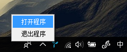

# Tray

>Using AWT tray-system-call in JavaFX 


>在JavaFX组件中使用AWT系统托盘API，最小化Stage到系统托盘

 
>参考文档：https://stackoverflow.com/questions/12571329/javafx-app-in-system-tray

## 使用示例

```Java
	minButton.setOnAction(new EventHandler<ActionEvent>() {
		//监听最小化按钮事件
		@Override
		public void handle(ActionEvent event) {
			//primaryStage.setIconified(true);
			//最小化Stage到任务栏
			Tray taryWindow = new Tray(primaryStage, Session.iconUrl, title);
			//实例化Tray对象,传参Stage，icon的url和要显示的标题
			taryWindow.tray();
			//最小化Stage到系统托盘
		}
	});
```

## 效果示例


